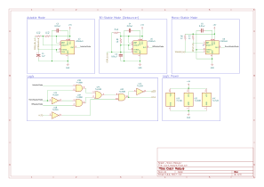
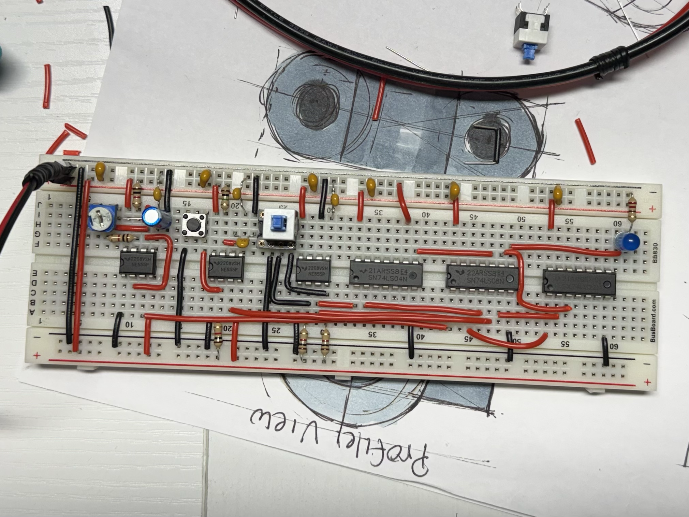

# Intro

Before I started this clock module, I had a prior experience with the components being presented. Therefore, understanding how it works didn't become a problem; most of the struggle is wiring 